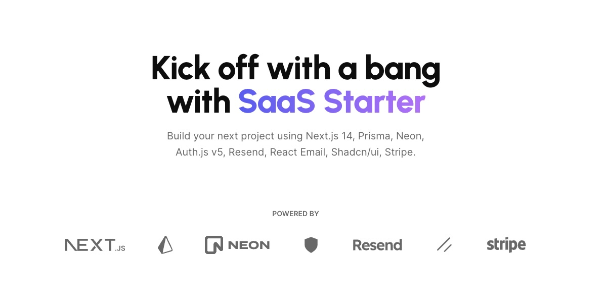

# PlayerConnect

<p align="center">
  
  <h1 align="center">PlayerConnect</h1>
</p>

<p align="center">
  La plateforme qui connecte les athlètes et les recruteurs sportifs
</p>

<p align="center">
  <a href="#introduction"><strong>Introduction</strong></a> ·
  <a href="#fonctionnalités-principales"><strong>Fonctionnalités</strong></a> ·
  <a href="#tech-stack"><strong>Tech Stack</strong></a> ·
  <a href="#installation"><strong>Installation</strong></a> ·
  <a href="#roadmap"><strong>Roadmap</strong></a>
</p>
<br/>

## Introduction

PlayerConnect est une plateforme innovante conçue pour faciliter la mise en relation entre athlètes et recruteurs sportifs. Notre application permet aux athlètes de créer leur profil, partager leurs performances et médias, tandis que les recruteurs peuvent découvrir de nouveaux talents et suivre leur progression.

## Fonctionnalités principales

### Pour les athlètes

- Création d'un profil détaillé avec informations sportives
- Gestion d'un calendrier d'événements et de matchs
- Partage de vidéos et médias de performances
- Suivi des statistiques et KPIs sportifs
- Visibilité auprès des recruteurs

### Pour les recruteurs

- Découverte des meilleurs athlètes par sport et catégorie
- Visualisation des médias et performances des athlètes
- Système de notification pour les nouveaux contenus
- Gestion des contacts et communication avec les athlètes

## Tech Stack

PlayerConnect est construit avec les technologies modernes suivantes :

- [Next.js 14](https://nextjs.org/) – Framework React pour des applications performantes
- [Auth.js v5](https://authjs.dev/) – Gestion de l'authentification avec différents fournisseurs
- [Prisma](https://www.prisma.io/) – ORM TypeScript pour Node.js
- [Neon](https://neon.tech/) – Base de données PostgreSQL serverless
- [Shadcn/ui](https://ui.shadcn.com/) – Composants UI réutilisables
- [FullCalendar](https://fullcalendar.io/) – Gestion avancée de calendrier
- [Supabase Storage](https://supabase.com/) – Stockage des médias et vidéos
- [Tailwind CSS](https://tailwindcss.com/) – Framework CSS utilitaire

## Installation

1. Clonez le dépôt :

```bash
git clone https://github.com/votre-username/playerconnect.git
```

2. Installez les dépendances avec pnpm :

```sh
pnpm install
```

3. Copiez `.env.example` vers `.env.local` et mettez à jour les variables :

```sh
cp .env.example .env.local
```

4. Lancez le serveur de développement :

```sh
pnpm run dev
```

## Structure du projet

- `app/` - Routes et pages de l'application (Next.js App Router)
- `components/` - Composants UI réutilisables
- `lib/` - Utilitaires, hooks et configuration
- `prisma/` - Schéma de base de données et migrations
- `public/` - Fichiers statiques
- `styles/` - Styles globaux et configuration Tailwind

## Roadmap

- [x] Authentification et gestion des profils
- [x] Tableau de bord athlète avec statistiques
- [x] Tableau de bord recruteur avec découverte d'athlètes
- [x] Gestion de calendrier et d'événements
- [x] Upload et partage de médias
- [ ] Système de messagerie entre athlètes et recruteurs
- [ ] Notifications en temps réel
- [ ] Application mobile (React Native)
- [ ] Analyse avancée des performances

## Contribuer

Nous accueillons les contributions à PlayerConnect ! N'hésitez pas à ouvrir une issue ou une pull request.
